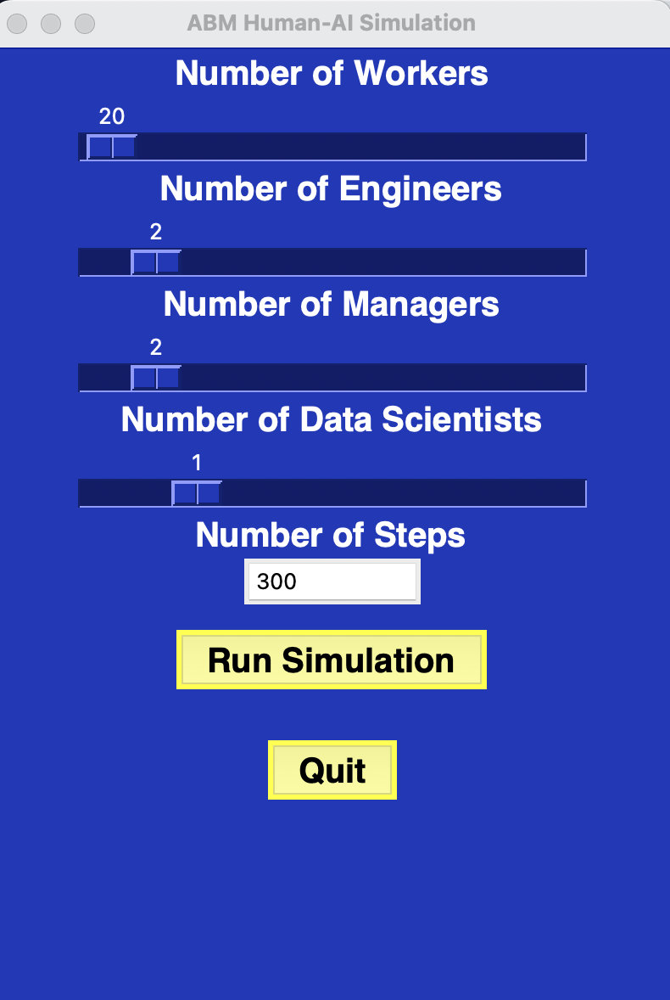
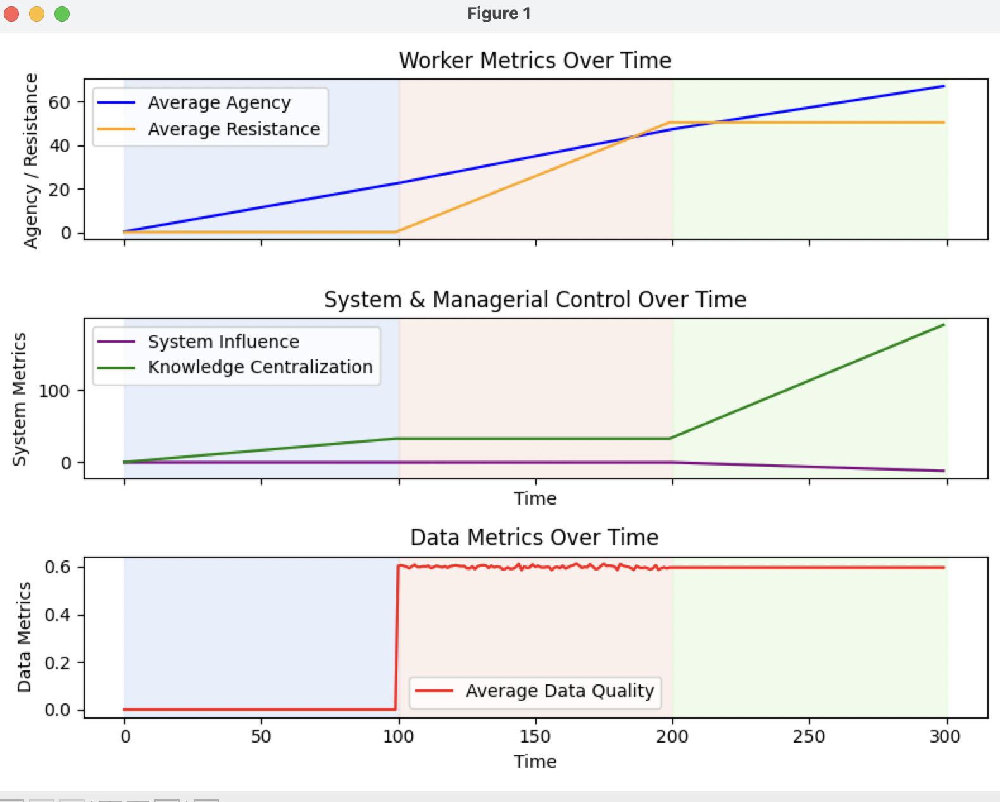

# Workflow ABM – Simulating Control and Participation in Algorithmic Management

This project is a prototype agent-based model (ABM) designed to simulate the dynamics described in:

**Krzywdzinski, M., Schneiß, J., & Sperling, L. (2024).**  
*Between Control and Participation: The Politics of Algorithmic Management*.  
_New Technology, Work and Employment_.

The model explores how managers, engineers, workers, and algorithmic systems interact across three key phases of algorithmic management:

- **Goal formation**  
- **Data production**  
- **Data analysis**  

It investigates how knowledge centralization, worker resistance, and agency evolve over time under different conditions.

## Features

- Agent classes:
  - Workers (participation, resistance, agency)
  - Engineers (system setup, knowledge mediation)
  - DataScientists (fairness focus, expertise)
  - Managers (control orientation, feedback acceptance)
  - Algorithmic systems (transparency, decision influence)
- Simulation of a recurring management cycle
- Data collection on key fairness and power metrics
- Built using the [Mesa ABM framework](https://mesa.readthedocs.io/en/stable/)

## Workflow
After installing the dependencies, run the following command [where the project is located] to start the simulation:
```bash
python tkinter_app.py
```
This will open a GUI window displaying the features of the simulation. You can interact with the simulation by clicking on the buttons and sliders to change the conditions and run the simulation. Press run to see the plots.

Screenshots of the GUI and plots are included below:







## Requirements

- Python 3.7+
- [Mesa](https://github.com/projectmesa/mesa)

Install dependencies:

```bash
pip install mesa
